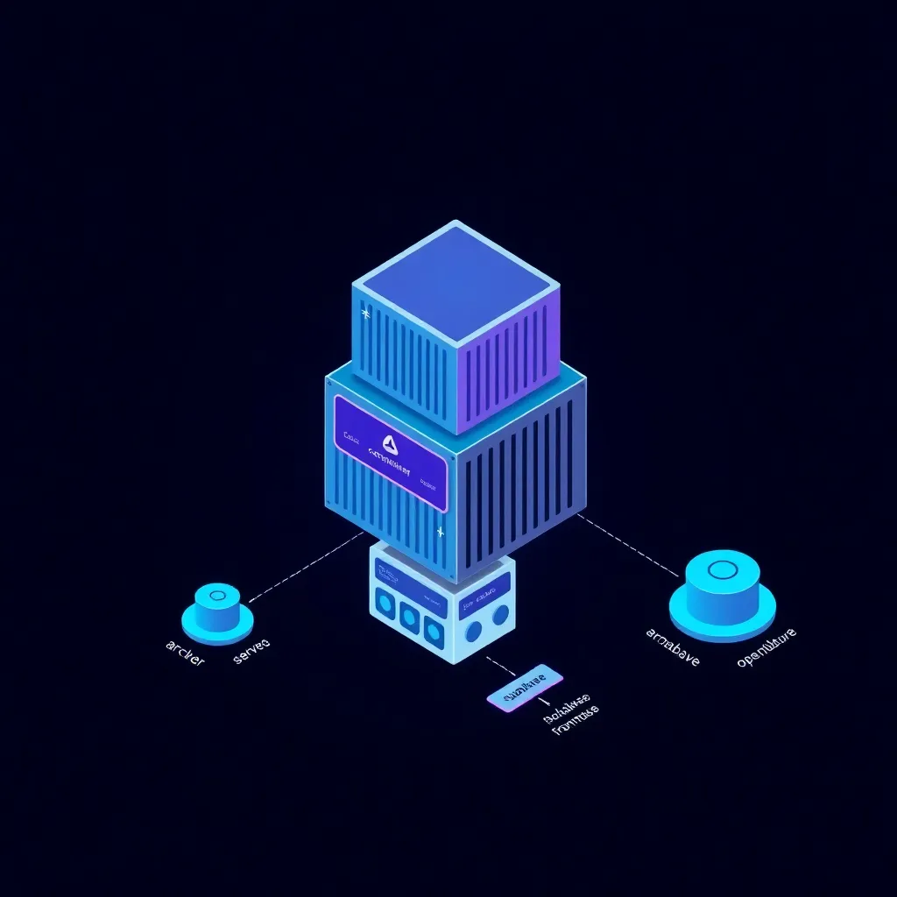

# AeyeOps Archon Minimal Stack

This repository contains a minimal, self‑contained launcher for running Archon either from published container images or directly from source. It avoids pulling in the whole upstream codebase while remaining easy to keep up‑to‑date.

The stack is idempotent: re-running the launcher reconciles containers and preserves your existing configuration.

## Prerequisites

- Docker and Docker Compose
- A Supabase project (Cloud or local CLI)
  - Required values: `SUPABASE_URL` and `SUPABASE_SERVICE_KEY` (service_role key)

## Quick Start (Images)

1. Copy and edit environment

```bash
cp .env.sample .env
# Edit .env:
# - ARCHON_*_IMAGE to point at your images
# - SUPABASE_URL, SUPABASE_URL_CONTAINER, SUPABASE_SERVICE_KEY
```

2. Launch

```bash
bash ./archon-up.sh
```

By default, the launcher:
- Enables single‑port mode (`PROD=true`), so the API is served under `/api` on port `3737`.
- Starts OpenObserve via the Compose profile (UI on `5080`, OTLP at `openobserve:4318`).
- Starts Agents.

### Example image sets

Option A — locally built images (if you have recently built Archon from source on this machine, the images below likely exist):

```bash
ARCHON_SERVER_IMAGE=archon-archon-server:latest
ARCHON_MCP_IMAGE=archon-archon-mcp:latest
ARCHON_FRONTEND_IMAGE=archon-archon-frontend:latest
ARCHON_AGENTS_IMAGE=archon-archon-agents:latest
```

Option B — published images (replace with your registry paths and tags):

```bash
ARCHON_SERVER_IMAGE=ghcr.io/your-org/archon-server:latest
ARCHON_MCP_IMAGE=ghcr.io/your-org/archon-mcp:latest
ARCHON_FRONTEND_IMAGE=ghcr.io/your-org/archon-frontend:latest
ARCHON_AGENTS_IMAGE=ghcr.io/your-org/archon-agents:latest
```

## Quick Start (Source)

Use this if you prefer to run from the upstream repository without manually cloning or wiring environment variables.

```bash
bash ./bootstrap-from-source.sh
```

What it does:
- Clones `https://github.com/coleam00/archon.git` into `./archon-src` (or pulls latest if it already exists).
- Creates `archon-src/.env` from examples if missing.
- If a local Supabase CLI project is detected (e.g., `supabase/.env` with `SERVICE_ROLE_KEY`), it auto‑populates:
  - `SUPABASE_URL=http://127.0.0.1:54321`
  - `SUPABASE_URL_CONTAINER=http://host.docker.internal:54321`
  - `SUPABASE_SERVICE_KEY=<SERVICE_ROLE_KEY>`
- Starts Archon from source by invoking the repo’s launcher.

To initialize Supabase CLI locally (optional):

```bash
cd archon-src
npx supabase@latest init
npx supabase start
```

## Configuration

- `HOST` — IP or hostname to expose externally on your LAN. The launcher ensures it is added to `VITE_ALLOWED_HOSTS` without duplicates.
- `PROD` — when `true`, the UI serves the API at `/api` on port `3737`.
- `VITE_ALLOWED_HOSTS` — comma‑separated allowlist for Vite dev server host checks. The launcher appends `HOST` if missing.
- Observability — by default, OpenObserve runs via Compose and the containers export telemetry to `http://openobserve:4318` on the internal network.

Idempotency and safety:
- The launcher never overwrites existing keys in `.env`. It only creates missing keys and merges allowlists.
- If an `openobserve` container already exists, it is reused and attached to the app network to avoid name conflicts.

## Endpoints

- UI: `http://HOST:3737`
- API: `http://HOST:3737/api` (when `PROD=true`) or `http://HOST:8181`
- MCP: `http://HOST:8051`
- Agents: `http://HOST:8052`
- Observability (OpenObserve): `http://HOST:5080`

## Archon Visuals (Replicate)

Two lightweight, repo‑aligned visuals generated via Replicate:

- Stack diagram (isometric, dark theme)
  - 
- Emblem (geometric eye + archway motif)
  - 

These are illustrative only; they do not change runtime behavior.

## One‑Time Database Setup

Run the contents of `migration/complete_setup.sql` in your Supabase SQL editor to initialize required tables and settings.

## Troubleshooting

- API not reachable via UI port:
  - Ensure `PROD=true` and restart the UI + server containers.
- CORS or host errors:
  - Set `HOST` to your LAN IP or hostname and ensure it’s present in `VITE_ALLOWED_HOSTS`.
- No traces in OpenObserve:
  - Confirm the containers export to `OTEL_EXPORTER_OTLP_ENDPOINT_CONTAINER=http://openobserve:4318` and that the `openobserve` container is running.
- Supabase permission errors:
  - Verify you are using the `service_role` key and that `SUPABASE_URL` is correct (Cloud or `127.0.0.1:54321` for local CLI).

## Notes

- This minimal stack is designed to be independent of the upstream repository while still allowing a source‑based workflow when desired.
- The launchers are idempotent and safe to re‑run.
